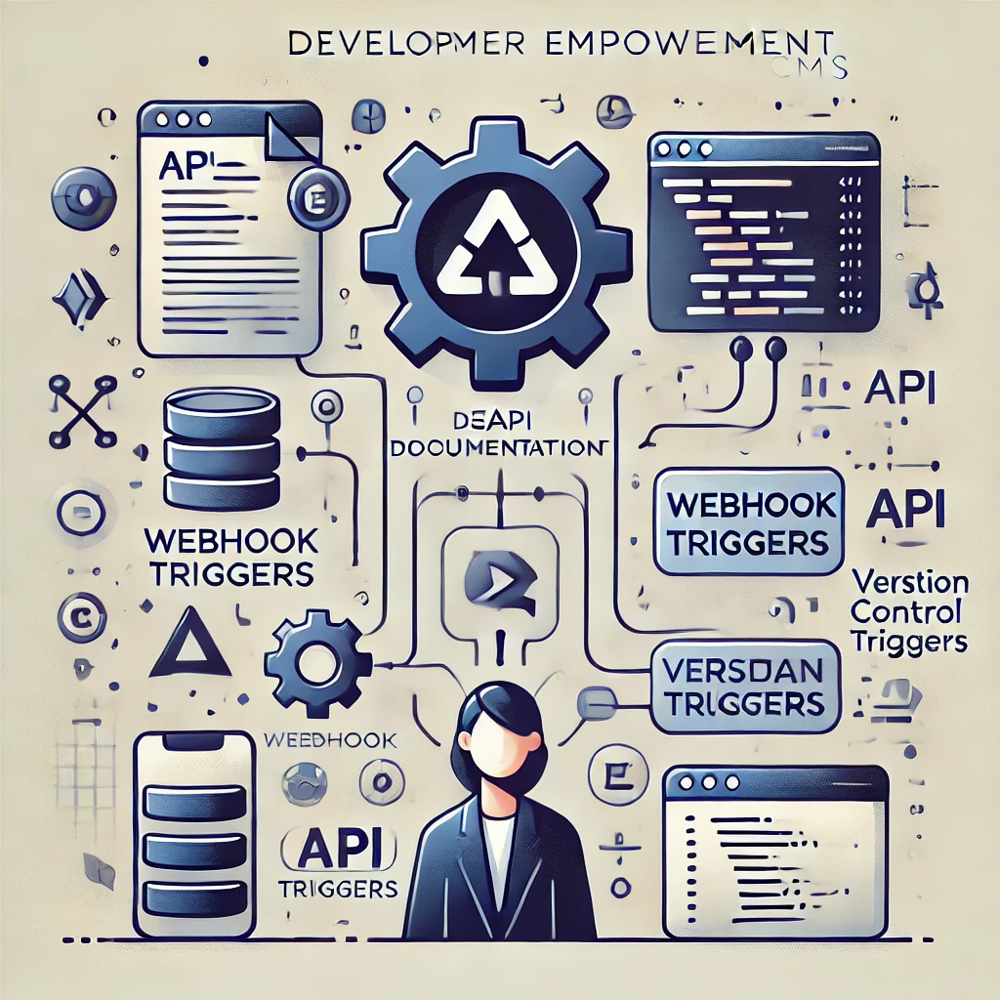

# Nodify: Ihre vielseitige Headless-CMS-Lösung

**Nahtlose Content-Erlebnisse über alle Kanäle hinweg liefern**

## Was ist ein Headless CMS?

* Trennt das Frontend (Präsentationsebene) vom Backend (Content-Management)
* Liefert Inhalte über APIs
* Hochgradig anpassbar und flexibel

## Warum Nodify wählen?

* **Mehrsprachig:** Erstellen und verwalten Sie Inhalte in mehreren Sprachen.
* **Multichannel:** Liefern Sie Inhalte auf jedes Gerät oder jede Plattform.
* **Hochgradig anpassbar:** Passen Sie das CMS an Ihre spezifischen Bedürfnisse an.
* **Skalierbar:** Verwalten Sie problemlos wachsende Inhaltsmengen.
* **Entwicklerfreundlich:** Leistungsstarke APIs und Integrationen.

## Inhalte überall und jederzeit bereitstellen

* Websites
* Mobile Apps
* IoT-Geräte
* Soziale Medien
* Sprachassistenten

## Flexibilität und Anpassung

* Anpassbare Inhaltsmodelle: Definieren Sie Ihre eigenen Content-Strukturen.
* Flexible APIs: Integrieren Sie Nodify in Ihre bestehende Technologielandschaft.
* Erweiterbar mit Plugins: Fügen Sie bei Bedarf neue Funktionen hinzu.

## Globale Content-Erlebnisse schaffen

* Inhalte einfach übersetzen: Verwalten Sie Versionen in mehreren Sprachen.
* Inhalte regionalisieren: Sprechen Sie gezielt bestimmte Zielgruppen an.
* Komplexe mehrsprachige Anforderungen bewältigen: Unterstützt verschiedene Schriftsysteme und Dialekte.

## Ihr Entwicklungsteam stärken

* Leistungsstarke APIs: RESTful APIs für nahtlose Integration.
* Webhooks: Aktionen basierend auf Ereignissen auslösen.
* Versionskontrolle: Änderungen verfolgen und effektiv zusammenarbeiten.

## Ihre Inhalte, Ihr Weg

* Zusammenfassung der wichtigsten Vorteile
* Handlungsaufforderung: Probieren Sie Nodify noch heute aus!

## Installation
[INSTALLATION.md](assets/INSTALLATION.md)

## Lizenz

Nodify ist unter der Creative Commons Attribution-NonCommercial 4.0 International **(CC BY-NC 4.0)** lizenziert.

Dieses Projekt steht unter der Creative Commons BY-NC 4.0 Lizenz.

**Sie dürfen:**

* Teilen — Das Softwareprodukt auf jedem Medium oder Format kopieren und weiterverbreiten.
* Bearbeiten — Remixen, transformieren und darauf aufbauen.

**Unter den folgenden Bedingungen:**

* Keine kommerzielle Nutzung — Sie dürfen diese Software nicht für kommerzielle Zwecke verwenden.
* Namensnennung — Sie müssen eine angemessene Quellenangabe machen, einen Link zur Lizenz bereitstellen und angeben, ob Änderungen vorgenommen wurden.

Die vollständige Lizenz finden Sie hier: [https://creativecommons.org/licenses/by-nc/4.0/](https://creativecommons.org/licenses/by-nc/4.0/)

