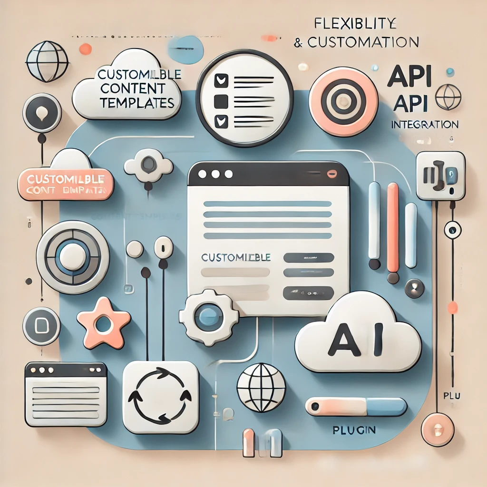
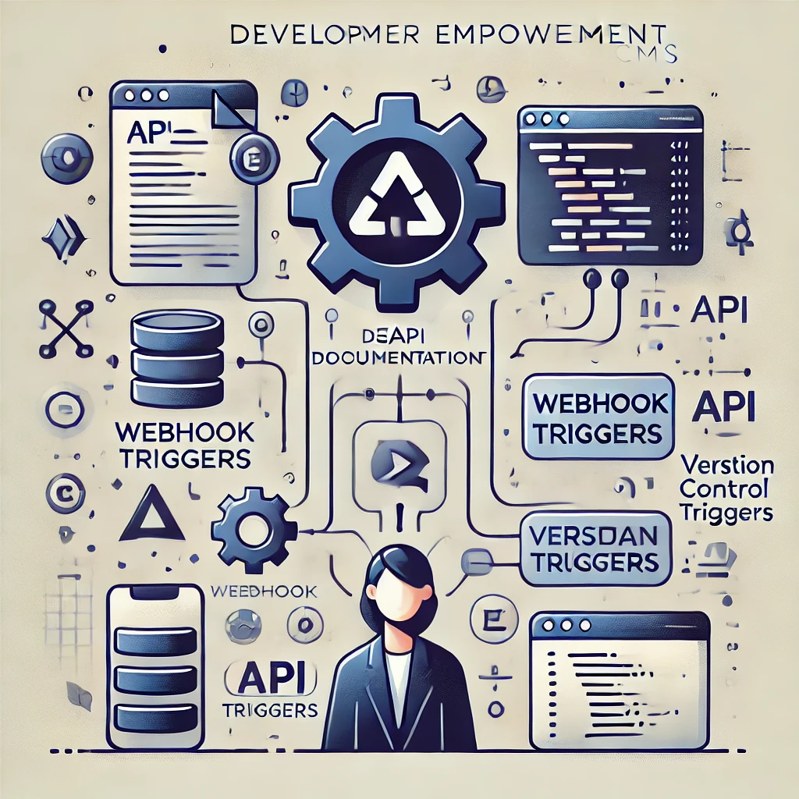

# Nodify: आपका बहुमुखी हेडलेस CMS समाधान

**सभी चैनलों पर सहज सामग्री अनुभव प्रदान करना**

## हेडलेस CMS क्या है?

* फ्रंटएंड (प्रस्तुति स्तर) को बैकएंड (सामग्री प्रबंधन) से अलग करता है।
* API के माध्यम से सामग्री वितरित करता है।
* अत्यधिक अनुकूलन योग्य और अनुकूलनीय।

## Nodify क्यों चुनें?

* **बहुभाषी:** कई भाषाओं में सामग्री बनाएं और प्रबंधित करें।
* **मल्टीचैनल:** किसी भी डिवाइस या प्लेटफॉर्म पर सामग्री वितरित करें।
* **अत्यधिक अनुकूलन योग्य:** CMS को अपनी विशिष्ट आवश्यकताओं के अनुसार अनुकूलित करें।
* **स्केलेबल:** बढ़ती सामग्री मात्रा को आसानी से प्रबंधित करें।
* **डेवलपर-फ्रेंडली:** शक्तिशाली API और एकीकरण समर्थन।

## कहीं भी, कभी भी सामग्री वितरित करें

* वेबसाइट
* मोबाइल ऐप
* IoT डिवाइस
* सोशल मीडिया
* वॉयस असिस्टेंट

## लचीलापन और अनुकूलन

* **कस्टमाइज़ेबल कंटेंट मॉडल:** अपनी स्वयं की सामग्री संरचनाएँ परिभाषित करें।
* **लचीली API:** अपने मौजूदा तकनीकी स्टैक के साथ एकीकृत करें।
* **प्लगइन्स द्वारा विस्तारित:** आवश्यकतानुसार नई सुविधाएँ जोड़ें।

## वैश्विक सामग्री अनुभव बनाएं

* **सामग्री को आसानी से अनुवाद करें:** कई भाषाओं में संस्करण प्रबंधित करें।
* **क्षेत्रीय सामग्री:** विशिष्ट दर्शकों को लक्षित करें।
* **जटिल बहुभाषी आवश्यकताओं को संभालें:** विभिन्न लेखन प्रणालियों और बोलियों का समर्थन करें।

## अपनी विकास टीम को सशक्त बनाएं

* **मजबूत API:** निर्बाध एकीकरण के लिए RESTful API।
* **वेबहुक्स:** घटनाओं के आधार पर क्रियाएँ ट्रिगर करें।
* **संस्करण नियंत्रण:** परिवर्तनों को ट्रैक करें और प्रभावी रूप से सहयोग करें।

## आपकी सामग्री, आपके अनुसार

* प्रमुख लाभों का सारांश।
* कार्रवाई के लिए कॉल: आज ही Nodify आज़माएँ!

## लाइसेंस

Nodify को **क्रिएटिव कॉमन्स एट्रिब्यूशन-नॉनकमर्शियल 4.0 इंटरनेशनल (CC BY-NC 4.0)** लाइसेंस के तहत लाइसेंस प्राप्त है।

यह प्रोजेक्ट क्रिएटिव कॉमन्स BY-NC 4.0 लाइसेंस के अंतर्गत लाइसेंस प्राप्त है।

**आप निम्न करने के लिए स्वतंत्र हैं:**

* **साझा करें** — किसी भी माध्यम या प्रारूप में सॉफ़्टवेयर की प्रतिलिपि बनाएँ और पुनर्वितरित करें।
* **अनुकूलित करें** — सॉफ़्टवेयर को रीमिक्स करें, परिवर्तित करें और आगे विकसित करें।

**लेकिन निम्नलिखित शर्तों के तहत:**

* **व्यावसायिक उपयोग नहीं** — आप इस सॉफ़्टवेयर का व्यावसायिक उद्देश्यों के लिए उपयोग नहीं कर सकते।
* **एट्रिब्यूशन (श्रेय देना)** — आपको उचित श्रेय देना होगा, लाइसेंस का लिंक प्रदान करना होगा, और यह इंगित करना होगा कि क्या परिवर्तन किए गए हैं।

पूर्ण लाइसेंस यहाँ देखें: [https://creativecommons.org/licenses/by-nc/4.0/](https://creativecommons.org/licenses/by-nc/4.0/)

