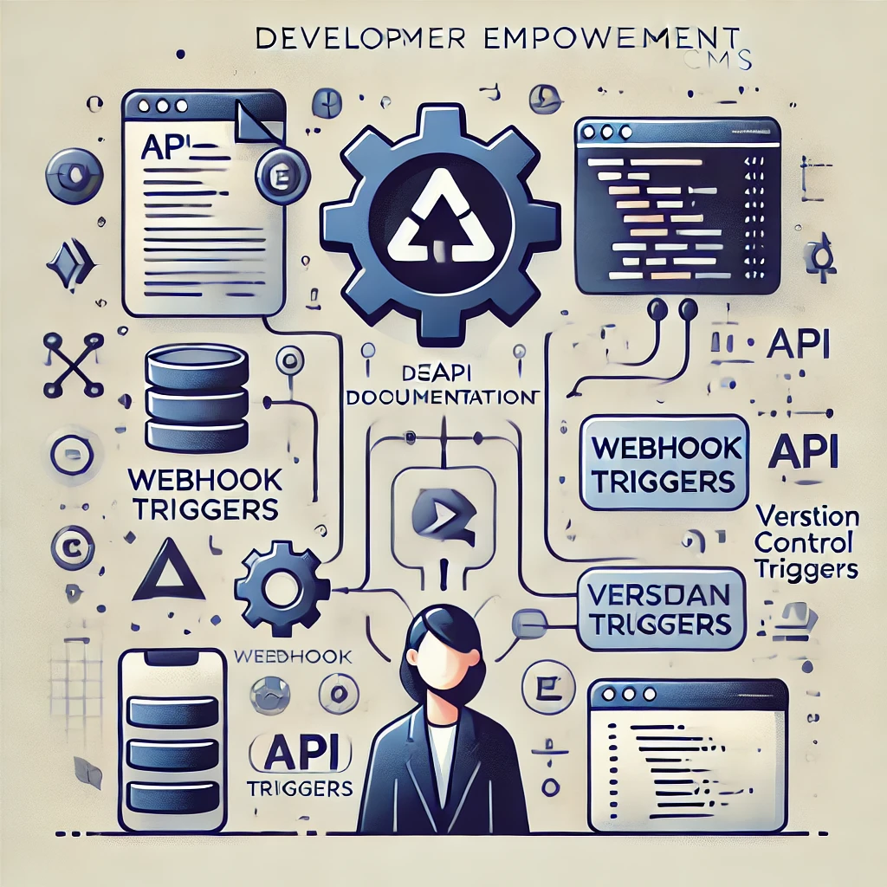

[](https://creativecommons.org/licenses/by-nc/4.0/)
[](https://github.com/AZIRARM/nodify/actions/workflows/maven.yml)
[](https://github.com/AZIRARM/nodify/stargazers)
[](https://github.com/AZIRARM/nodify/network/members)
[](https://hub.docker.com/r/azirar/nodify-api)

# 🚀 Nodify: The Most Powerful Open-Source Headless CMS as a True CaaS

**Delivering seamless content experiences across all channels — natively multilingual, any content, any channel.**

## 📦 Official Repositories

| Repository | Description |
| :--- | :--- |
| **[nodify](https://github.com/AZIRARM/nodify)** | Core Nodify Headless CMS project |
| **[nodify-clients](https://github.com/AZIRARM/nodify-clients)** | Official clients for Java, Python, and Node.js |
| **[nodify-templates](https://github.com/AZIRARM/nodify-templates)** | Ready-to-use templates for Nodify Studio |
| **[nodify-plugins](https://github.com/AZIRARM/nodify-plugins)** | Extensible plugins for Nodify |
| **[nodify-php-client](https://github.com/AZIRARM/nodify-php-client)** | PHP client for Nodify API |

## 🚀 Demo

You can explore a live demo of **Nodify Headless CMS** here:  
🔗 [Nodify Demo](https://nodify.azirar.ovh)

**Get Started:**
* **Registration:** You can now create your own account directly on the demo platform to start testing.
* **Availability:** The demo server is accessible daily from **10:00 AM** to **12:00 AM** (UTC+1).

> ⚠️ This is a shared demo environment. Data may be reset at any time.

## 📚 Quick Links

* 📖 [Documentation](#)
* 🎨 [Templates Gallery](https://github.com/AZIRARM/nodify-templates)
* 🔌 [Plugins Marketplace](https://github.com/AZIRARM/nodify-plugins)
* 💻 [Client Libraries](https://github.com/AZIRARM/nodify-clients)
* 🐘 [PHP Client](https://github.com/AZIRARM/nodify-php-client)

## ✨ Why Nodify?

| Feature | Description |
| :--- | :--- |
| 🌍 **Native Multilingual** | Any content, any language, any channel |
| 📦 **Official SDKs** | Python, PHP, Java/Kotlin, Node.js |
| 🔌 **Extensible** | Plugins, webhooks, and custom APIs |
| 🐳 **Docker-ready** | One-command deployment |
| 🎨 **Ready Templates** | Tech Forum, News, E-commerce, Stories |

## Understanding Headless CMS

* Separates the front-end (presentation layer) from the back-end (content management)
* Delivers content through APIs
* Highly customizable and adaptable


## Why Choose Nodify?

* **Multilingual:** Create and manage content in multiple languages.
* **Multichannel:** Deliver content to any device or platform.
* **Highly customizable:** Tailor the CMS to your specific needs.
* **Scalable:** Easily handle growing content volumes.
* **Developer-friendly:** Robust APIs and integrations.


## Deliver Content Anywhere, Anytime

* Websites
* Mobile apps
* IoT devices
* Social media
* Voice assistants


## Flexibility and Customization

* **Customizable content models:** Define your own content structures.
* **Flexible APIs:** Integrate with your existing tech stack.
* **Extensible with plugins:** Add new features as needed.


## Create Global Content Experiences

* **Translate content easily:** Manage multiple language versions.
* **Regionalize content:** Target specific audiences.
* **Handle complex multilingual requirements:** Support various writing systems and dialects.


## Empower Your Development Team

* **Robust APIs:** RESTful APIs for seamless integration.
* **Webhooks:** Trigger actions based on events.
* **Version control:** Track changes and collaborate effectively.



## 🎯 Ready-to-Use Templates

Nodify comes with pre-built templates to accelerate your development:

* **Tech Forum Template** - Complete developer community forum
* **Tiny Tales Stories Template** - AI-powered children's stories generator
* **News Template** - Modern news publishing platform
* **E-commerce Template** - Product catalog and shopping experience

Explore all templates in the [nodify-templates](https://github.com/AZIRARM/nodify-templates) repository.

## 🔌 Extend with Plugins

Enhance your Nodify experience with official plugins:

* **SEO Optimizer** - Automatic meta tags and sitemap generation
* **Image Optimizer** - On-the-fly image resizing and optimization
* **Webhook Manager** - Advanced webhook configuration and monitoring
* **Analytics Dashboard** - Built-in content performance analytics

Browse all plugins in the [nodify-plugins](https://github.com/AZIRARM/nodify-plugins) repository.

## 💻 Client Libraries

Integrate Nodify with your tech stack using official clients:

| Language | Repository |
| :--- | :--- |
| **Java** | [nodify-clients/java](https://github.com/AZIRARM/nodify-clients/tree/main/java) |
| **Python** | [nodify-clients/python](https://github.com/AZIRARM/nodify-clients/tree/main/python) |
| **Node.js** | [nodify-clients/nodejs](https://github.com/AZIRARM/nodify-clients/tree/main/nodejs) |
| **PHP** | [nodify-php-client](https://github.com/AZIRARM/nodify-php-client) |

## 📊 GitHub Stats

[]([https://github.com/AZIRARM/nodify/releases](https://github.com/AZIRARM/nodify/releases))
[](https://github.com/AZIRARM/nodify/commits/main)
[](https://github.com/AZIRARM/nodify/graphs/contributors)

## 📥 Installation

### Quick Start with Docker Compose

Clone the repository and run Nodify with all dependencies (MongoDB and Redis included):

```bash
git clone https://github.com/AZIRARM/nodify.git
cd nodify
docker compose up -d
```

Nodify will be available at:
* **Nodify Studio:** http://localhost:7821
* **Nodify API:** http://localhost:7805
* **Nodify Core:** http://localhost:7804

### Docker Compose Configuration

```yaml
services:
  mongodb:
    image: mongo:latest
    container_name: nodify-mongodb
    volumes:
      - mongodb_data:/data/db
    ports:
      - "27017:27017"
    restart: unless-stopped

  redis:
    image: redis:latest
    container_name: nodify-redis
    volumes:
      - redis_data:/data
    ports:
      - "6379:6379"
    restart: unless-stopped

  nodify-core:
    image: azirar/nodify-core:latest
    container_name: nodify-core
    environment:
      MONGO_URL: "mongodb://mongodb:27017/nodify"
      ADMIN_PWD: Admin13579++
      API_URL: "http://nodify-api:1080"
      TZ: "${TZ:-Europe/Paris}"
      REDIS_URL: "redis://redis:6379"
      JAVA_OPTS: "-Xmx768m -Xms384m"
    ports:
      - "7804:8080"
    depends_on:
      - mongodb
      - redis
    restart: unless-stopped

  nodify-api:
    image: azirar/nodify-api:latest
    container_name: nodify-api
    environment:
      MONGO_URL: "mongodb://mongodb:27017/nodify"
      TZ: "${TZ:-Europe/Paris}"
      REDIS_URL: "redis://redis:6379"
      JAVA_OPTS: "-Xmx512m -Xms256m"
    ports:
      - "7805:1080"
    depends_on:
      - mongodb
      - redis
    restart: unless-stopped

  nodify-studio:
    image: azirar/nodify-studio:latest
    container_name: nodify-studio
    ports:
      - "7821:80"
    environment:
      CORE_URL: "http://nodify-core:8080"
      API_URL: "http://nodify-api:1080"
    depends_on:
      - nodify-core
      - nodify-api
    restart: unless-stopped

volumes:
  mongodb_data:
  redis_data:
```

### Environment Variables

| Variable | Description | Default |
| :-----------| :-----------------------------| :------------------------------- |
| `MONGO_URL` | MongoDB connection string     | `mongodb://mongodb:27017/nodify` |
| `REDIS_URL` | Redis connection URL          | `redis://redis:6379`             |
| `ADMIN_PWD` | Admin password                | `Admin13579++`                   |
| `API_URL`   | Public API URL                | `http://nodify-api:1080`         |
| `CORE_URL`  | Core service URL              | `http://nodify-core:8080`        |
| `JAVA_OPTS` | JVM options for Core and API  | See above                        |


## 🔐 Authentication

Nodify supports three authentication modes:

| Mode | Description | Configuration Required |
| :--- | :--- | :--- |
| **Internal** | Built-in email/password authentication | ❌ No configuration needed (default) |
| **OAuth2** | OAuth2 protocol authentication | ✅ Yes |
| **OpenID Connect** | OpenID Connect protocol authentication | ✅ Yes |

> 📖 **For detailed configuration instructions, see [Authentications.md](Authentications.md)**

### Default Behavior

By default, Nodify uses **Internal Authentication** with email and password. No additional configuration is required.

### External Providers (OAuth2 / OpenID)

To enable OAuth2 or OpenID Connect, you need to:
1. Configure your provider (e.g., Keycloak, Google, Auth0)
2. Set the required environment variables
3. Switch the authentication mode

Refer to the [Authentication Guide](Authentications.md) for:
- Complete environment variables list
- Provider configuration examples (Keycloak)
- Step-by-step setup instructions
```

## 🤝 Contributing

We welcome contributions! Please check our contribution guidelines before submitting pull requests.

## 📄 License

Nodify is licensed under the Creative Commons Attribution-NonCommercial 4.0 International **(CC BY-NC 4.0)**.

**You are free to:**
* **Share** — Copy and redistribute the software in any medium or format.
* **Adapt** — Remix, transform, and build upon the software.

**But under the following conditions:**
* **No Commercial Use** — You may not use this software for commercial purposes.
* **Attribution** — You must give appropriate credit, provide a link to the license, and indicate if changes were made.

See the full license here: [https://creativecommons.org/licenses/by-nc/4.0/](https://creativecommons.org/licenses/by-nc/4.0/)

## 🌟 Support

* 📧 **Email:** [nodify.headless.cms@gmail.com](mailto:nodify.headless.cms@gmail.com)
* 💬 **Issues:** [GitHub Issues](https://github.com/AZIRARM/nodify/issues)
* 📚 **Documentation:** [Wiki](https://github.com/AZIRARM/nodify/wiki)

**Made with ❤️ by the Nodify Community**