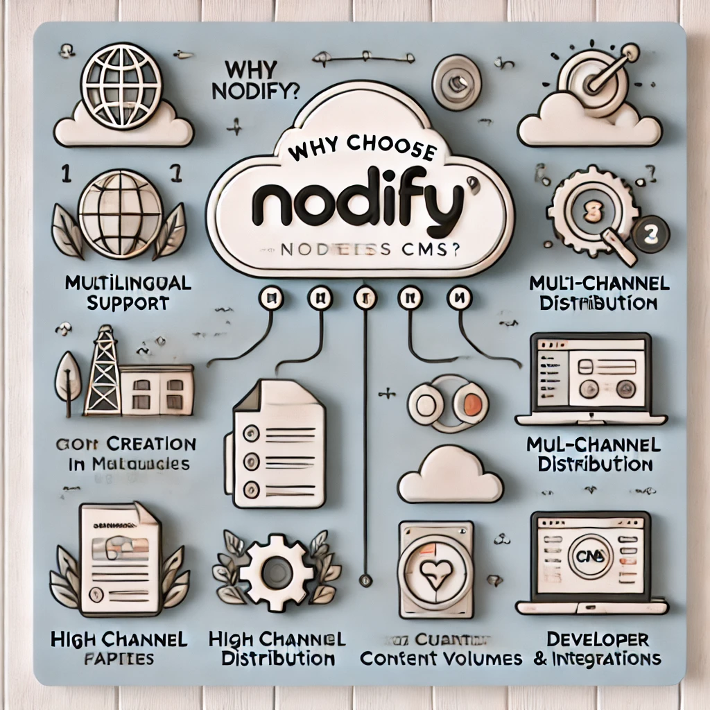

# Nodify: Your Versatile Headless CMS Solution

**Delivering seamless content experiences across all channels**

## 🚀 Demo

You can explore a live demo of **Nodify Headless CMS** here:  
🔗 [Nodify Demo](https://azirar.ovh:7822)

**Credentials:**
- **Username:** `admin`
- **Password:** `Admin13579++`

**Availability:**  
The demo server is accessible daily from **10:00 AM** to **12:00 AM** (UTC+1).

> ⚠️ This is a shared demo environment. Data may be reset at any time.

## Understanding Headless CMS

* Separates the front-end (presentation layer) from the back-end (content management)
* Delivers content through APIs
* Highly customizable and adaptable

## Why Choose Nodify?

* **Multilingual:** Create and manage content in multiple languages.
* **Multichannel:** Deliver content to any device or platform.
* **Highly customizable:** Tailor the CMS to your specific needs.
* **Scalable:** Easily handle growing content volumes.
* **Developer-friendly:** Robust APIs and integrations.

## Deliver Content Anywhere, Anytime

* Websites
* Mobile apps
* IoT devices
* Social media
* Voice assistants

## Flexibility and Customization

* Customizable content models: Define your own content structures.
* Flexible APIs: Integrate with your existing tech stack.
* Extensible with plugins: Add new features as needed.

## Create Global Content Experiences

* Translate content easily: Manage multiple language versions.
* Regionalize content: Target specific audiences.
* Handle complex multilingual requirements: Support various writing systems and dialects.

## Empower Your Development Team

* Robust APIs: RESTful APIs for seamless integration.
* Webhooks: Trigger actions based on events.
* Version control: Track changes and collaborate effectively.

## Your Content, Your Way

* Summary of key benefits
* Call to action: Try Nodify today

## Installation
[INSTALLATION.md](assets/INSTALLATION.md)

## License
Nodify is licensed under the Creative Commons Attribution-NonCommercial 4.0 International **(CC BY-NC 4.0)**.

This project is licensed under the Creative Commons BY-NC 4.0 license.

**You are free to:**

* Share — Copy and redistribute the software in any medium or format.
* Adapt — Remix, transform, and build upon the software.

**But under the following conditions:**

* No Commercial Use — You may not use this software for commercial purposes.
* Attribution — You must give appropriate credit, provide a link to the license, and indicate if changes were made.

See the full license here: https://creativecommons.org/licenses/by-nc/4.0/

